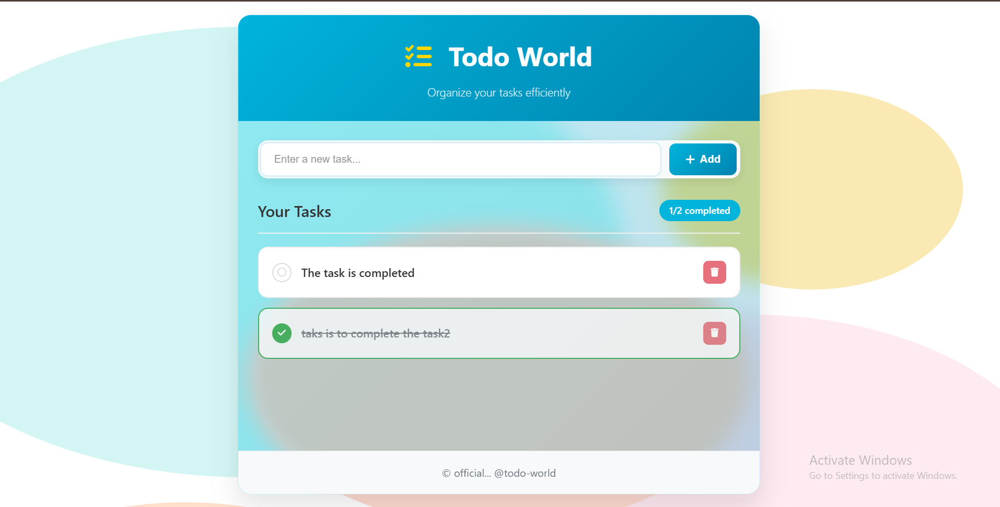

#  Todo World App

A beautiful, responsive todo list application built with HTML, CSS, and JavaScript. Features a modern watercolor design with glassmorphism effects and smooth animations.

##  Features

###  Design & UI
- Watercolor Background: Beautiful artistic background with soft gradients
- Glassmorphism Effect: Modern semi-transparent container with blur effects
- Responsive Design: Works perfectly on desktop, tablet, and mobile devices
- Smooth Animations: Elegant transitions and hover effects
- Modern Color Scheme: Teal/cyan gradient theme with professional styling

###  Functionality
-  Add Tasks: Add new tasks with input validation
-  Complete Tasks: Toggle task completion status
- Delete Tasks: Remove tasks with smooth fade-out animation
- Task Counter: Real-time display of total and completed tasks
-  Keyboard Support: Press Enter to add tasks
- Instant Updates: No page reload required

### Responsive Features
- Mobile-First Design: Optimized for all screen sizes
- Touch-Friendly: Large buttons and proper spacing for mobile
- Adaptive Layout: Elements stack and resize appropriately
- Cross-Platform: Works on all modern browsers
